# ECG Signal Processor using CORDIC Algorithm — RTL to GDS Flow

> A complete digital VLSI implementation of an ECG signal processing core using the CORDIC (Coordinate Rotation Digital Computer) algorithm, taken through a full RTL-to-GDS flow using open-source and/or industry-standard EDA tools.

---

## Table of Contents

1. [Project Overview](#project-overview)
2. [Block Diagram](#block-diagram)
3. [CORDIC Algorithm — Theory](#cordic-algorithm--theory)
4. [ECG Signal Processing Pipeline](#ecg-signal-processing-pipeline)
5. [ECG Signal Extraction from MIT-BIH Database](#ECG-Signal-Extraction-from-MIT-BIH-Database)
6. [RTL Design](#rtl-design)
   - [Top-Level: qrs_cordic_detector](#top-level-qrs_cordic_detector)
   - [Bandpass Filter (5-15 Hz)](#bandpass-filter-515-hz)
   - [Pipelined CORDIC Magnitude](#pipelined-cordic-magnitude)
   - [QRS R-Peak Detector](#qrs-r-peak-detector)
   - [RR Interval and BPM Calculator](#rr-interval-and-bpm-calculator)
   - [Integer Square Root](#integer-square-root)
   - [HRV Metrics Module](#hrv-metrics-module)
7. [Testbench](#testbench)
8. [Functional Simulation](#functional-simulation)
9. [Pantopkins Algorithm functional verification](#Pantopkins-Algorithm-functional-verification)
10. [Synthesis](#synthesis)
11. [Placement](#Placement)
12. [CTS](#CTS)
13. [Routing](#Routing)
14. [DRC-Connectivity-Verification](#DRC-Connectivity-verification)
15. [Sign-off and GDS Generation](#sign-off-and-gds-generation)
16. [Results and Reports](#results-and-reports)
17. [References](#references)

---

## Project Overview

This project implements a **hardware ECG signal processor** that performs real-time computation of key cardiac parameters — including QRS complex detection, R-peak identification, heart rate estimation, and Heart Rate Variability (HRV) metrics — using the **CORDIC algorithm** as the computational backbone for hardware-efficient vector magnitude operations (no multipliers required).

The design is taken through a complete **RTL-to-GDS (tape-out-ready) physical design flow**, covering RTL coding, functional simulation, logic synthesis, DFT scan insertion, static timing analysis, formal verification, place and route, physical verification, and GDS-II generation.

### Key Design Parameters

| Parameter | Value |
|-----------|-------|
| Technology node | GPDK 90nm |
| Sampling frequency | 360 Hz (MIT-BIH standard) |
| Clock frequency | 200MHz |
| CORDIC iterations | 16 |
| Pipeline stages | 16 (fully pipelined CORDIC) |
| Word length | 16-bit signed fixed-point |
| Bandpass filter | 5–15 Hz, 5-tap symmetric FIR |
| HRV metrics | RMSSD, SDNN, pNN50, Pearson Correlation |
| Scan coverage target | ≥ 95% |
| Core area | 58389.537um^2 |
| Power | 13.5mW|

---

## Block Diagram


---

## CORDIC Algorithm — Theory


The **CORDIC (Coordinate Rotation Digital Computer)** algorithm computes trigonometric, hyperbolic, and vector magnitude functions using only **additions, subtractions, and bit shifts** — making it ideal for resource-constrained hardware with no dedicated multiplier units.

### Vector Mode — used in this design

At each iteration `i`, the micro-rotation rule is:

```
if y[i] >= 0:
    x[i+1] = x[i] + (y[i] >> i)
    y[i+1] = y[i] - (x[i] >> i)
else:
    x[i+1] = x[i] - (y[i] >> i)
    y[i+1] = y[i] + (x[i] >> i)
```

After `N` iterations, `x[N]` converges to `K * sqrt(x^2 + y^2)` where `K ≈ 1.6468` is the CORDIC gain constant. This design takes:
- `x_in` = current filtered ECG sample
- `y_in` = differentiated ECG sample (captures slope/edge energy)

The magnitude output captures the combined signal energy envelope, enabling robust R-peak detection that is resistant to amplitude drift.

### Implementation Parameters

| Parameter | Value |
|-----------|-------|
| Iterations | 16 |
| Data format | 16-bit signed fixed-point |
| Mode | Vector (magnitude computation) |
| Architecture | Fully pipelined (one result per clock after 16-cycle latency) |

> **CORDIC Gain Note:** Output is scaled by K ≈ 1.6468. Thresholds in `qrs_peak_detect` are calibrated against raw CORDIC output. For absolute magnitude, multiply output by `1/K ≈ 0.6073` (fixed-point: multiply by 39243, right-shift by 16).

---

## ECG Signal Processing Pipeline

### Stage 0 — Bandpass Filter (5–15 Hz)
5-tap symmetric FIR filter targeting the QRS energy band. Removes baseline wander (< 5 Hz) and high-frequency EMG noise (> 15 Hz). Coefficients: `[119, 206, 226, 206, 119]`, normalized by 876.

### Stage 1 — Differentiator
Computes `ecg_diff = ecg_filtered[n] − ecg_filtered[n−1]` to highlight the steep slope characteristic of a QRS complex.

### Stage 2 — Pipelined CORDIC Magnitude
Computes `mag ≈ K * sqrt(ecg_filtered^2 + ecg_diff^2)` using the 16-stage pipelined CORDIC core.

### Stage 3 — QRS R-Peak Detector
Dual-threshold hysteresis detector (HIGH = 6000, LOW = 4000) with a 140-sample refractory period (~389 ms @ 360 Hz) to suppress double-detection within a single beat.

### Stage 4 — RR Interval and BPM
Counts sample ticks between consecutive R-peaks. `RR_ms = (count * 1000) / FS_HZ`, `BPM = (FS_HZ * 60) / count`.

### Stage 5 — HRV Metrics
Computes RMSSD, SDNN, pNN50, and Pearson Correlation Coefficient between consecutive RR pairs using running accumulators. Valid RR range: 300–2000 ms.

### Disease Classification (Testbench)

| Classification | Criterion |
|----------------|-----------|
| BRADYCARDIA | Average BPM < 60 |
| TACHYCARDIA | Average BPM > 100 |
| ARRHYTHMIA_SUSPECTED | SDNN > 100 ms OR RMSSD > 80 ms OR pNN50 > 20% |
| NORMAL | None of the above |

---

## ECG Signal Extraction from MIT-BIH Database

We focused on extracting and analyzing ECG (Electrocardiogram) signals from the MIT-BIH Arrhythmia Database using MATLAB.

The ECG signal files are downloaded from the database and processed using MATLAB code. The program reads the raw signal data, extracts useful ECG samples, and converts them into a simple .txt format for easy viewing and further analysis.

This helps in understanding heart signal patterns and can be useful for applications like arrhythmia detection and biomedical signal processing.

[MIT-BIH Arrhythmia Database](https://physionet.org/content/mitdb/1.0.0/)

Below MATLAB code is used to convert raw ECG signal format to .txt format which is finally fed to the design.

```MATLAB
clc; clear;

fs = 360;   % Sampling frequency (optional, if needed later)

% Load ECG data from .dat file
% Replace '100.dat' with your actual file name
ecg = load('100.dat');

% Convert to column vector
ecg = ecg(:);

% Save full data into .txt file
writematrix(ecg, '100_ecg.txt');

fprintf('.txt file generated successfully: %d samples saved\n', length(ecg));
```

---

## RTL Design

### Top-Level: qrs_cordic_detector

The top-level module instantiates and wires all sub-modules in the signal processing pipeline.

```verilog
//============================================================
// QRS complex detection using CORDIC magnitude (pipelined)
// + HRV metrics: RMSSD, SDNN, pNN50, Correlation Coefficient
// + Bandpass filter (5-15 Hz) for noise reduction
//============================================================
module qrs_cordic_detector #(
    parameter FS_HZ          = 360,
    parameter DATA_WIDTH     = 16,
    parameter CORDIC_ITER    = 16,
    parameter THRESHOLD_MAG  = 8000
)(
    input  wire                         clk,
    input  wire                         reset_n,
    input  wire signed [DATA_WIDTH-1:0] ecg_sample,
    input  wire                         sample_valid,
    output wire                         r_peak_pulse,
    output wire [31:0]                  rr_interval_ms,
    output wire [15:0]                  bpm,
    output wire                         rr_valid,
    output wire [31:0]                  rmssd_out,
    output wire [31:0]                  sdnn_out,
    output wire [15:0]                  pnn50_out,
    output wire signed [15:0]           correlation_coeff,
    output wire                         hrv_valid
);

    // -----------------------------
    // 0) Bandpass filter (5-15 Hz)
    // -----------------------------
    wire signed [DATA_WIDTH-1:0] ecg_filtered;
    wire                         filter_valid;

    bandpass_filter_5_15 u_bpf (
        .clk       (clk),
        .reset_n   (reset_n),
        .ecg_in    (ecg_sample),
        .in_valid  (sample_valid),
        .ecg_out   (ecg_filtered),
        .out_valid (filter_valid)
    );

    // -----------------------------
    // 1) Simple differentiator
    // -----------------------------
    reg signed [DATA_WIDTH-1:0] ecg_prev;
    wire signed [DATA_WIDTH:0]   ecg_diff;

    always @(posedge clk or negedge reset_n) begin
        if (!reset_n) begin
            ecg_prev <= 'd0;
        end else if (filter_valid) begin
            ecg_prev <= ecg_filtered;
        end
    end

    assign ecg_diff = ecg_filtered - ecg_prev;

    // -----------------------------
    // 2) Pipelined CORDIC magnitude
    // -----------------------------
    localparam CORDIC_W = CORDIC_ITER;

    wire signed [CORDIC_W-1:0] cordic_x_in;
    wire signed [CORDIC_W-1:0] cordic_y_in;

    assign cordic_x_in = ecg_filtered[DATA_WIDTH-1 -: CORDIC_W];
    assign cordic_y_in = ecg_diff    [DATA_WIDTH   -: CORDIC_W];

    wire [CORDIC_W-1:0] mag_out;
    wire                mag_valid;

    cordic_mag_pipelined #(
        .WIDTH (CORDIC_W),
        .ITER  (CORDIC_ITER)
    ) u_cordic (
        .clk       (clk),
        .reset_n   (reset_n),
        .x_in      (cordic_x_in),
        .y_in      (cordic_y_in),
        .in_valid  (filter_valid),
        .mag_out   (mag_out),
        .mag_valid (mag_valid)
    );

    // -----------------------------
    // 3) QRS / R-peak detector
    // -----------------------------
    qrs_peak_detect #(
        .WIDTH          (CORDIC_W),
        .THRESHOLD_HIGH (6000),
        .THRESHOLD_LOW  (4000),
        .REFRAC_SAMPLES (140)
    ) u_peak (
        .clk           (clk),
        .reset_n       (reset_n),
        .mag_sample    (mag_out),
        .mag_valid     (mag_valid),
        .r_peak_pulse  (r_peak_pulse)
    );

    // -----------------------------
    // 4) RR and BPM
    // -----------------------------
    rr_bpm_calc #(
        .FS_HZ (FS_HZ)
    ) u_rr (
        .clk            (clk),
        .reset_n        (reset_n),
        .sample_tick    (sample_valid),
        .r_peak_pulse   (r_peak_pulse),
        .rr_interval_ms (rr_interval_ms),
        .bpm            (bpm),
        .rr_valid       (rr_valid)
    );

    // -----------------------------
    // 5) HRV metrics (with correlation)
    // -----------------------------
    hrv_metrics u_hrv (
        .clk                (clk),
        .reset_n            (reset_n),
        .rr_interval_ms     (rr_interval_ms),
        .rr_valid           (rr_valid),
        .rmssd_out          (rmssd_out),
        .sdnn_out           (sdnn_out),
        .pnn50_out          (pnn50_out),
        .correlation_coeff  (correlation_coeff),
        .hrv_valid          (hrv_valid)
    );

endmodule
```

---

### Bandpass Filter (5–15 Hz)

5-tap symmetric FIR filter. Suppresses baseline wander and high-frequency noise outside the QRS band.

```verilog
//============================================================
// Bandpass filter (5-15 Hz @ 360 Hz)
//============================================================
module bandpass_filter_5_15 (
    input  wire        clk,
    input  wire        reset_n,
    input  wire signed [15:0] ecg_in,
    input  wire        in_valid,
    output reg  signed [15:0] ecg_out,
    output reg         out_valid
);
    localparam COEFF0 = 119;
    localparam COEFF1 = 206;
    localparam COEFF2 = 226;

    reg signed [15:0] delay [0:4];
    reg signed [31:0] sum;
    integer i;

    always @(posedge clk or negedge reset_n) begin
        if (!reset_n) begin
            for (i = 0; i < 5; i = i + 1) delay[i] <= 16'sd0;
            out_valid <= 1'b0;
            ecg_out   <= 16'sd0;
        end else begin
            out_valid <= in_valid;

            if (in_valid) begin
                for (i = 4; i > 0; i = i - 1)
                    delay[i] <= delay[i-1];
                delay[0] <= ecg_in;

                sum = COEFF0 * (delay[0] + delay[4])
                    + COEFF1 * (delay[1] + delay[3])
                    + COEFF2 * (delay[2]);

                ecg_out <= sum / 876;
            end
        end
    end
endmodule
```

---

### Pipelined CORDIC Magnitude

16-stage fully pipelined CORDIC core in vector mode. Each stage implements one micro-rotation. Latency = ITER clock cycles; throughput = 1 result per clock after pipeline fill.

```verilog
//============================================================
// Pipelined CORDIC magnitude
//============================================================
module cordic_mag_pipelined #(
    parameter WIDTH = 16,
    parameter ITER  = 16
)(
    input  wire                    clk,
    input  wire                    reset_n,
    input  wire signed [WIDTH-1:0] x_in,
    input  wire signed [WIDTH-1:0] y_in,
    input  wire                    in_valid,
    output wire [WIDTH-1:0]        mag_out,
    output wire                    mag_valid
);

    reg signed [WIDTH-1:0] x [0:ITER];
    reg signed [WIDTH-1:0] y [0:ITER];
    reg                    v [0:ITER];
    integer i;

    always @(posedge clk or negedge reset_n) begin
        if (!reset_n) begin
            for (i = 0; i <= ITER; i = i + 1) begin
                x[i] <= 'd0;
                y[i] <= 'd0;
                v[i] <= 1'b0;
            end
        end else begin
            x[0] <= x_in;
            y[0] <= y_in;
            v[0] <= in_valid;

            for (i = 0; i < ITER; i = i + 1) begin
                if (y[i] >= 0) begin
                    x[i+1] <= x[i] + (y[i] >>> i);
                    y[i+1] <= y[i] - (x[i] >>> i);
                end else begin
                    x[i+1] <= x[i] - (y[i] >>> i);
                    y[i+1] <= y[i] + (x[i] >>> i);
                end
                v[i+1] <= v[i];
            end
        end
    end

    assign mag_out   = x[ITER];
    assign mag_valid = v[ITER];

endmodule
```

---

### QRS R-Peak Detector

Dual-threshold hysteresis detector with post-detection refractory period.

| Parameter | Default | Description |
|-----------|---------|-------------|
| THRESHOLD_HIGH | 6000 | Trigger level — must exceed to fire |
| THRESHOLD_LOW | 4000 | Reset level — must fall below to re-arm |
| REFRAC_SAMPLES | 140 | ~389 ms blackout after each detection |

```verilog
//============================================================
// QRS R-peak detector
//============================================================
module qrs_peak_detect #(
    parameter WIDTH           = 16,
    parameter THRESHOLD_HIGH  = 6000,
    parameter THRESHOLD_LOW   = 4000,
    parameter REFRAC_SAMPLES  = 180
)(
    input  wire             clk,
    input  wire             reset_n,
    input  wire [WIDTH-1:0] mag_sample,
    input  wire             mag_valid,
    output reg              r_peak_pulse
);

    reg armed;
    reg [$clog2(REFRAC_SAMPLES+1)-1:0] refrac_cnt;

    wire above_high = (mag_sample >= THRESHOLD_HIGH);
    wire below_low  = (mag_sample <= THRESHOLD_LOW);

    always @(posedge clk or negedge reset_n) begin
        if (!reset_n) begin
            armed        <= 1'b1;
            refrac_cnt   <= 'd0;
            r_peak_pulse <= 1'b0;
        end else begin
            r_peak_pulse <= 1'b0;

            if (mag_valid) begin
                if (refrac_cnt != 0) begin
                    refrac_cnt <= refrac_cnt - 1;
                    armed      <= 1'b0;
                end else begin
                    if (armed && above_high) begin
                        r_peak_pulse <= 1'b1;
                        armed        <= 1'b0;
                        refrac_cnt   <= REFRAC_SAMPLES - 1;
                    end else if (!armed && below_low) begin
                        armed <= 1'b1;
                    end
                end
            end
        end
    end

endmodule
```

---

### RR Interval and BPM Calculator

Counts sample ticks between consecutive R-peaks and computes the RR interval (ms) and instantaneous heart rate (BPM).

```verilog
//============================================================
// RR interval and BPM calculator
//============================================================
module rr_bpm_calc #(
    parameter FS_HZ = 360
)(
    input  wire        clk,
    input  wire        reset_n,
    input  wire        sample_tick,
    input  wire        r_peak_pulse,
    output reg  [31:0] rr_interval_ms,
    output reg  [15:0] bpm,
    output reg         rr_valid
);

    reg [31:0] sample_count;
    reg        first_peak_seen;

    always @(posedge clk or negedge reset_n) begin
        if (!reset_n) begin
            sample_count    <= 32'd0;
            first_peak_seen <= 1'b0;
            rr_interval_ms  <= 32'd0;
            bpm             <= 16'd0;
            rr_valid        <= 1'b0;
        end else begin
            rr_valid <= 1'b0;

            if (sample_tick)
                sample_count <= sample_count + 1;

            if (r_peak_pulse) begin
                if (!first_peak_seen) begin
                    first_peak_seen <= 1'b1;
                    sample_count    <= 32'd0;
                end else begin
                    rr_interval_ms <= (sample_count * 32'd1000) / FS_HZ;

                    if (sample_count != 0)
                        bpm <= (FS_HZ * 32'd60) / sample_count;
                    else
                        bpm <= 16'd0;

                    rr_valid     <= 1'b1;
                    sample_count <= 32'd0;
                end
            end
        end
    end

endmodule
```

---

### Integer Square Root

Combinational 32-bit integer square root, producing a 16-bit result. Used by `hrv_metrics` for RMSSD, SDNN, and correlation denominator computation.

```verilog
//============================================================
// Integer square root (32-bit input -> 16-bit output)
//============================================================
module isqrt32 (
    input  wire [31:0] x,
    output wire [15:0] y
);
    reg [31:0] rem;
    reg [15:0] root;
    reg [31:0] test;
    integer i;

    always @(*) begin
        rem  = 32'd0;
        root = 16'd0;
        for (i = 15; i >= 0; i = i - 1) begin
            rem  = {rem[29:0], x[2*i+1], x[2*i]};
            test = {root, 2'b01};
            if (rem >= {root, 1'b0, 1'b0} + 1) begin
                rem  = rem - ({root, 1'b0} + 1);
                root = {root[14:0], 1'b1};
            end else begin
                root = {root[14:0], 1'b0};
            end
        end
    end

    assign y = root;
endmodule
```

> **Synthesis note:** This is a 16-iteration combinational loop — it will unroll fully and may become a timing-critical path. Registering its inputs/outputs or pipelining may be needed after STA.

---

### HRV Metrics Module

Computes four HRV metrics using running accumulators updated on each valid RR interval. The Pearson Correlation Coefficient is computed between consecutive RR pairs, scaled by 1000 and represented as a signed 16-bit integer (range −1000 to +1000). Outputs are registered and updated after each new beat.

```verilog
//============================================================
// HRV Metrics Module (with CORRECTED Pearson Correlation)
//============================================================
module hrv_metrics (
    input  wire        clk,
    input  wire        reset_n,
    input  wire [31:0] rr_interval_ms,
    input  wire        rr_valid,
    output reg  [31:0] rmssd_out,
    output reg  [31:0] sdnn_out,
    output reg  [15:0] pnn50_out,
    output reg  signed [15:0] correlation_coeff,
    output reg         hrv_valid
);

    localparam RR_MIN_MS = 300;
    localparam RR_MAX_MS = 2000;

    // Basic statistics
    reg [31:0]  N;
    reg [63:0]  sum_rr;
    reg [63:0]  sum_rr2;
    reg [31:0]  prev_rr;
    reg         prev_valid;
    reg [63:0]  sum_drr2;
    reg [31:0]  N_diff;
    reg [31:0]  cnt_nn50;

    // Correlation coefficient accumulators
    reg [63:0]  sum_xy;
    reg [63:0]  sum_x;
    reg [63:0]  sum_y;
    reg [63:0]  sum_x2;
    reg [63:0]  sum_y2;
    reg [31:0]  N_corr;

    wire in_range = (rr_interval_ms >= RR_MIN_MS) &&
                    (rr_interval_ms <= RR_MAX_MS);

    wire signed [32:0] d_rr;
    assign d_rr = $signed({1'b0, rr_interval_ms}) -
                  $signed({1'b0, prev_rr});

    wire [32:0] abs_drr;
    assign abs_drr = d_rr[32] ? (~d_rr + 1'b1) : d_rr;

    wire [63:0] drr2;
    assign drr2 = abs_drr * abs_drr;

    wire [63:0] rr2;
    assign rr2 = rr_interval_ms * rr_interval_ms;

    always @(posedge clk or negedge reset_n) begin
        if (!reset_n) begin
            N          <= 32'd0;
            sum_rr     <= 64'd0;
            sum_rr2    <= 64'd0;
            prev_rr    <= 32'd0;
            prev_valid <= 1'b0;
            sum_drr2   <= 64'd0;
            N_diff     <= 32'd0;
            cnt_nn50   <= 32'd0;

            sum_xy     <= 64'd0;
            sum_x      <= 64'd0;
            sum_y      <= 64'd0;
            sum_x2     <= 64'd0;
            sum_y2     <= 64'd0;
            N_corr     <= 32'd0;

            rmssd_out  <= 32'd0;
            sdnn_out   <= 32'd0;
            pnn50_out  <= 16'd0;
            correlation_coeff <= 16'sd0;
            hrv_valid  <= 1'b0;
        end else begin
            hrv_valid <= 1'b0;

            if (rr_valid && in_range) begin
                N       <= N + 1;
                sum_rr  <= sum_rr  + rr_interval_ms;
                sum_rr2 <= sum_rr2 + rr2;

                if (prev_valid) begin
                    sum_drr2 <= sum_drr2 + drr2;
                    N_diff   <= N_diff + 1;
                    if (abs_drr > 33'd50)
                        cnt_nn50 <= cnt_nn50 + 1;
                end

                if (prev_valid) begin
                    sum_xy <= sum_xy + (rr_interval_ms * prev_rr);
                    sum_x  <= sum_x  + rr_interval_ms;
                    sum_y  <= sum_y  + prev_rr;
                    sum_x2 <= sum_x2 + (rr_interval_ms * rr_interval_ms);
                    sum_y2 <= sum_y2 + (prev_rr * prev_rr);
                    N_corr <= N_corr + 1;
                end

                prev_rr    <= rr_interval_ms;
                prev_valid <= 1'b1;
                hrv_valid  <= 1'b1;
            end
        end
    end

    // --- RMSSD ---
    wire [63:0] mean_drr2 = (N_diff > 0) ? (sum_drr2 / N_diff) : 64'd0;
    wire [15:0] rmssd_tmp;
    isqrt32 u_sqrt_rmssd (.x(mean_drr2[31:0]), .y(rmssd_tmp));
    wire [31:0] rmssd_wire = {16'd0, rmssd_tmp};

    // --- SDNN ---
    wire [63:0] mean_rr    = (N > 0) ? (sum_rr  / N) : 64'd0;
    wire [63:0] mean_rr2   = (N > 0) ? (sum_rr2 / N) : 64'd0;
    wire [63:0] mean_rr_sq = mean_rr * mean_rr;
    wire [63:0] var_rr     = (mean_rr2 >= mean_rr_sq) ?
                             (mean_rr2 - mean_rr_sq) : 64'd0;
    wire [15:0] sdnn_tmp;
    isqrt32 u_sqrt_sdnn (.x(var_rr[31:0]), .y(sdnn_tmp));
    wire [31:0] sdnn_wire = {16'd0, sdnn_tmp};

    // --- pNN50 ---
    wire [31:0] pnn50_wire = (N_diff > 0) ?
                             ((cnt_nn50 * 32'd100) / N_diff) : 32'd0;

    // --- Pearson Correlation Coefficient ---
    wire [63:0] numerator_signed    = (N_corr * sum_xy) - (sum_x * sum_y);
    wire        numerator_negative  = numerator_signed[63];
    wire [63:0] numerator_abs       = numerator_negative ?
                                      (~numerator_signed + 1'b1) : numerator_signed;
    wire [63:0] denominator_x       = (N_corr * sum_x2) - (sum_x * sum_x);
    wire [63:0] denominator_y       = (N_corr * sum_y2) - (sum_y * sum_y);
    wire [63:0] denominator_product = denominator_x * denominator_y;
    wire [15:0] denominator_sqrt16;
    isqrt32 u_sqrt_corr (.x(denominator_product[31:0]), .y(denominator_sqrt16));
    wire [31:0] denominator_sqrt_full    = {16'd0, denominator_sqrt16};
    wire [31:0] correlation_scaled_abs   =
                (denominator_sqrt_full > 0) ?
                ((numerator_abs * 32'd1000) / denominator_sqrt_full) : 32'd0;
    wire [31:0] correlation_scaled       =
                (correlation_scaled_abs > 32'd1000) ? 32'd1000 : correlation_scaled_abs;
    wire signed [15:0] correlation_final =
                numerator_negative ?
                -$signed(correlation_scaled[15:0]) :
                 $signed(correlation_scaled[15:0]);

    // --- Register outputs ---
    always @(posedge clk or negedge reset_n) begin
        if (!reset_n) begin
            rmssd_out         <= 32'd0;
            sdnn_out          <= 32'd0;
            pnn50_out         <= 16'd0;
            correlation_coeff <= 16'sd0;
        end else if (hrv_valid) begin
            rmssd_out <= rmssd_wire;
            sdnn_out  <= sdnn_wire;
            pnn50_out <= pnn50_wire[15:0];
            // Only output correlation if we have enough samples (>= 3 pairs)
            if (N_corr >= 3)
                correlation_coeff <= correlation_final;
            else
                correlation_coeff <= 16'sd0;
        end
    end

endmodule
```

---

## Testbench


### Testbench Code

```systemverilog
`timescale 1ns/1ps

module tb_qrs_final_display;

    // -------------------------
    // Parameters
    // -------------------------
    localparam int FS_HZ      = 360;
    localparam int DATA_WIDTH = 16;
    localparam time CLK_PERIOD = 10ns;

    // -------------------------
    // DUT I/O signals
    // -------------------------
    logic clk;
    logic reset_n;

    logic signed [DATA_WIDTH-1:0] ecg_sample;
    logic                         sample_valid;

    logic                         r_peak_pulse;
    logic [31:0]                  rr_interval_ms;
    logic [15:0]                  bpm;
    logic                         rr_valid;

    // ---- HRV outputs ----
    logic [31:0]                  rmssd_out;
    logic [31:0]                  sdnn_out;
    logic [15:0]                  pnn50_out;
    logic signed [15:0]           correlation_coeff;
    logic                         hrv_valid;

    // -------------------------
    // TB accumulators
    // -------------------------
    logic [63:0] sum_rr_ms;
    int          rr_count;
    int          rr_min_ms;
    int          rr_max_ms;
    int          r_peak_count;
    int          sample_idx_save;

    // final results
    int    final_mean_rr_ms;
    int    final_avg_bpm;
    real   final_correlation;
    string final_disease_str;

    // -------------------------
    // Files & indices
    // -------------------------
    integer fd_in;
    integer fd_det;
    integer fd_summary;
    integer r;
    integer sample_int;
    integer sample_idx;

    // -------------------------
    // Clock
    // -------------------------
    initial begin
        clk = 0;
        forever #(CLK_PERIOD/2) clk = ~clk;
    end

    // -------------------------
    // Instantiate DUT
    // -------------------------
    qrs_cordic_detector #(
        .FS_HZ      (FS_HZ),
        .DATA_WIDTH (DATA_WIDTH),
        .CORDIC_ITER(16)
    ) dut (
        .clk                (clk),
        .reset_n            (reset_n),
        .ecg_sample         (ecg_sample),
        .sample_valid       (sample_valid),
        .r_peak_pulse       (r_peak_pulse),
        .rr_interval_ms     (rr_interval_ms),
        .bpm                (bpm),
        .rr_valid           (rr_valid),
        .rmssd_out          (rmssd_out),
        .sdnn_out           (sdnn_out),
        .pnn50_out          (pnn50_out),
        .correlation_coeff  (correlation_coeff),
        .hrv_valid          (hrv_valid)
    );

    // -------------------------
    // Stimulus: feed ECG file
    // -------------------------
    initial begin
        sample_valid  = 1'b0;
        sample_idx    = -1;

        reset_n = 1'b0;
        repeat (10) @(posedge clk);
        reset_n = 1'b1;

        fd_in = $fopen("100_ecg.txt", "r");
        if (fd_in == 0) begin
            $display("ERROR: Could not open 100_ecg.txt");
            $finish;
        end else begin
            $display("Opened 100_ecg.txt for reading.");
        end

        fd_det     = $fopen("detection_samples.txt", "w");
        fd_summary = $fopen("final_summary.txt",     "w");

        while (!$feof(fd_in)) begin
            r = $fscanf(fd_in, "%d\n", sample_int);
            if (r == 1) begin
                sample_idx = sample_idx + 1;

                @(posedge clk);
                ecg_sample   <= sample_int[DATA_WIDTH-1:0];
                sample_valid <= 1'b1;

                @(posedge clk);
                sample_valid <= 1'b0;
            end else begin
                @(posedge clk);
            end
        end

        $display("EOF reached. Waiting for pipeline to flush...");
        repeat (1000) @(posedge clk);

        // --------------------------------------------------
        // Compute final metrics
        // --------------------------------------------------
        if (rr_count > 0) begin
            final_mean_rr_ms = sum_rr_ms / rr_count;
            if (final_mean_rr_ms > 0)
                final_avg_bpm = 60000 / final_mean_rr_ms;
            else
                final_avg_bpm = 0;

            final_correlation = correlation_coeff / 1000.0;

            if (final_avg_bpm < 60)
                final_disease_str = "BRADYCARDIA";
            else if (final_avg_bpm > 100)
                final_disease_str = "TACHYCARDIA";
            else if (sdnn_out > 100 || rmssd_out > 80 || pnn50_out > 20)
                final_disease_str = "ARRHYTHMIA_SUSPECTED";
            else
                final_disease_str = "NORMAL";
        end else begin
            final_mean_rr_ms  = 0;
            final_avg_bpm     = 0;
            final_correlation = 0.0;
            final_disease_str = "NO_RR_DETECTIONS";
        end

        $display("\n===== FINAL SUMMARY =====");
        $display("R-peaks detected       : %0d",  r_peak_count);
        $display("RR intervals collected : %0d",  rr_count);
        $display("Mean RR (ms)           : %0d",  final_mean_rr_ms);
        $display("Average HR (bpm)       : %0d",  final_avg_bpm);
        $display("RR min..max (ms)       : %0d .. %0d", rr_min_ms, rr_max_ms);
        $display("--- HRV Metrics ---");
        $display("RMSSD (ms)             : %0d ms",  rmssd_out);
        $display("SDNN  (ms)             : %0d ms",  sdnn_out);
        $display("pNN50 (%%)              : %0d %%",  pnn50_out);
        $display("Correlation Coeff (r)  : %0.3f",   final_correlation);
        $display("Disease classification : %s",      final_disease_str);
        $display("=========================\n");

        $fdisplay(fd_summary, "R_PEAK_COUNT,%0d",   r_peak_count);
        $fdisplay(fd_summary, "RR_COUNT,%0d",        rr_count);
        $fdisplay(fd_summary, "MEAN_RR_MS,%0d",      final_mean_rr_ms);
        $fdisplay(fd_summary, "AVG_BPM,%0d",         final_avg_bpm);
        $fdisplay(fd_summary, "RR_MIN_MS,%0d",       rr_min_ms);
        $fdisplay(fd_summary, "RR_MAX_MS,%0d",       rr_max_ms);
        $fdisplay(fd_summary, "RMSSD_MS,%0d",        rmssd_out);
        $fdisplay(fd_summary, "SDNN_MS,%0d",         sdnn_out);
        $fdisplay(fd_summary, "PNN50_PCT,%0d",       pnn50_out);
        $fdisplay(fd_summary, "CORRELATION_R,%0.3f", final_correlation);
        $fdisplay(fd_summary, "DISEASE,%s",          final_disease_str);

        $fclose(fd_in);
        $fclose(fd_det);
        $fclose(fd_summary);
        $finish;
    end

    // -------------------------
    // Monitor & accumulators
    // -------------------------
    always_ff @(posedge clk or negedge reset_n) begin
        if (!reset_n) begin
            sum_rr_ms       <= 64'd0;
            rr_count        <= 0;
            rr_min_ms       <= 32'h7fffffff;
            rr_max_ms       <= 0;
            r_peak_count    <= 0;
            sample_idx_save <= 0;
        end else begin
            if (r_peak_pulse) begin
                r_peak_count    <= r_peak_count + 1;
                sample_idx_save <= sample_idx;
                $fdisplay(fd_det, "%0d", sample_idx);
                $display("[%0t] R-peak #%0d detected at sample %0d",
                         $time, r_peak_count + 1, sample_idx);
            end

            if (rr_valid) begin
                sum_rr_ms <= sum_rr_ms + rr_interval_ms;
                rr_count  <= rr_count  + 1;
                if (rr_interval_ms < rr_min_ms) rr_min_ms <= rr_interval_ms;
                if (rr_interval_ms > rr_max_ms) rr_max_ms <= rr_interval_ms;
                $display("[%0t] RR=%0d ms  BPM=%0d  count=%0d",
                         $time, rr_interval_ms, bpm, rr_count);
            end

            if (hrv_valid) begin
                $display("[%0t] HRV update -> RMSSD=%0d ms  SDNN=%0d ms  pNN50=%0d%%  r=%0.3f",
                         $time, rmssd_out, sdnn_out, pnn50_out,
                         correlation_coeff / 1000.0);
            end
        end
    end

endmodule
```

---

## Functional Simulation

### Running the Simulation

Once all necessary design files are added to the Vivado working directory, the simulation is initiated using the **Run Simulation** option. The tool compiles the design and executes the simulation, after which the waveform viewer opens to display the detailed signal activity and behavior of the implemented design.

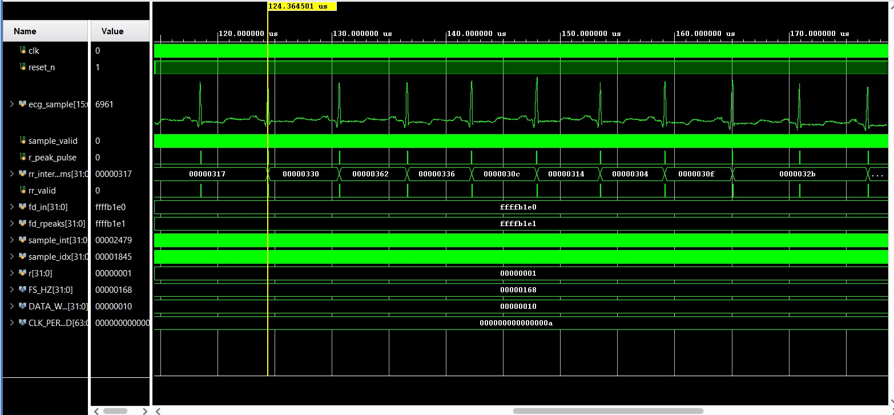


## Pantopkins Algorithm functional verification

To verify the correctness of our ECG signal processing design, we use the Pan-Tompkins Algorithm.

This algorithm is a widely used method for detecting QRS complexes in ECG signals. The extracted ECG data (from the MIT-BIH Arrhythmia Database) is processed using this algorithm, and the detected peaks are compared with expected results.

This verification step ensures that:
- The signal extraction is accurate  
- The processing flow is working correctly  
- The detected heartbeats align with the actual ECG waveform  

Functional verification confirms that the design produces reliable and correct outputs before further implementation.

The following is the MATLAB code of Pantopkins Algorithm

```MATLAB

function [qrs_amp_raw,qrs_i_raw,delay]=pan_tompkin(ecg,fs,gr)

%% function [qrs_amp_raw,qrs_i_raw,delay]=pan_tompkin(ecg,fs)
% Complete implementation of Pan-Tompkins algorithm

%% Inputs
% ecg : raw ecg vector signal 1d signal
% fs : sampling frequency e.g. 200Hz, 400Hz and etc
% gr : flag to plot or not plot (set it 1 to have a plot or set it zero not
% to see any plots
%% Outputs
% qrs_amp_raw : amplitude of R waves amplitudes
% qrs_i_raw : index of R waves
% delay : number of samples which the signal is delayed due to the
% filtering
%% Method
% See Ref and supporting documents on researchgate.
% https://www.researchgate.net/publication/313673153_Matlab_Implementation_of_Pan_Tompkins_ECG_QRS_detector
%% References :
%[1] Sedghamiz. H, "Matlab Implementation of Pan Tompkins ECG QRS
%detector.",2014. (See researchgate)
%[2] PAN.J, TOMPKINS. W.J,"A Real-Time QRS Detection Algorithm" IEEE
%TRANSACTIONS ON BIOMEDICAL ENGINEERING, VOL. BME-32, NO. 3, MARCH 1985.

%% ============== Licensce ========================================== %%
% THIS SOFTWARE IS PROVIDED BY THE COPYRIGHT HOLDERS AND CONTRIBUTORS 
% "AS IS" AND ANY EXPRESS OR IMPLIED WARRANTIES, INCLUDING, BUT NOT 
% LIMITED TO, THE IMPLIED WARRANTIES OF MERCHANTABILITY AND FITNESS 
% FOR A PARTICULAR PURPOSE ARE DISCLAIMED. IN NO EVENT SHALL THE COPYRIGHT
% OWNER OR CONTRIBUTORS BE LIABLE FOR ANY DIRECT, INDIRECT, INCIDENTAL, 
% SPECIAL, EXEMPLARY, OR CONSEQUENTIAL DAMAGES (INCLUDING, BUT NOT LIMITED
% TO, PROCUREMENT OF SUBSTITUTE GOODS OR SERVICES; LOSS OF USE, DATA, OR 
% PROFITS; OR BUSINESS INTERRUPTION) HOWEVER CAUSED AND ON ANY THEORY OF 
% LIABILITY, WHETHER IN CONTRACT, STRICT LIABILITY, OR TORT (INCLUDING 
% NEGLIGENCE OR OTHERWISE) ARISING IN ANY WAY OUT OF THE USE OF THIS 
% SOFTWARE, EVEN IF ADVISED OF THE POSSIBILITY OF SUCH DAMAGE.
% Author :
% Hooman Sedghamiz, Feb, 2018
% MSc. Biomedical Engineering, Linkoping University
% Email : Hooman.sedghamiz@gmail.com
%% ============ Update History ================== %%
% Feb 2018 : 
%           1- Cleaned up the code and added more comments
%           2- Added to BioSigKit Toolbox
%% ================= Now Part of BioSigKit ==================== %%
if ~isvector(ecg)
  error('ecg must be a row or column vector');
end
if nargin < 3
    gr = 1;   % on default the function always plots
end
ecg = ecg(:); % vectorize

%% ======================= Initialize =============================== %
delay = 0;
skip = 0;                                                                  % becomes one when a T wave is detected
m_selected_RR = 0;
mean_RR = 0;
ser_back = 0; 
ax = zeros(1,6);


%% ============ Noise cancelation(Filtering)( 5-15 Hz) =============== %%
if fs == 200
% ------------------ remove the mean of Signal -----------------------%
  ecg = ecg - mean(ecg);
%% ==== Low Pass Filter  H(z) = ((1 - z^(-6))^2)/(1 - z^(-1))^2 ==== %%
%%It has come to my attention the original filter doesnt achieve 12 Hz
%    b = [1 0 0 0 0 0 -2 0 0 0 0 0 1];
%    a = [1 -2 1];
%    ecg_l = filter(b,a,ecg); 
%    delay = 6;
%%%%%%%%%%%%%%%%%%%%%%%%%%%%%%%%%%%%%%%%%%%%%%%%%%%%%%%%%
   Wn = 12*2/fs;
   N = 3;                                                                  % order of 3 less processing
   [a,b] = butter(N,Wn,'low');                                             % bandpass filtering
   ecg_l = filtfilt(a,b,ecg); 
   ecg_l = ecg_l/ max(abs(ecg_l));
 %% ======================= start figure ============================= %%
   if gr
    figure;
    ax(1) = subplot(321);plot(ecg);axis tight;title('Raw signal');
    ax(2)=subplot(322);plot(ecg_l);axis tight;title('Low pass filtered');
   end
%% ==== High Pass filter H(z) = (-1+32z^(-16)+z^(-32))/(1+z^(-1)) ==== %%
%%It has come to my attention the original filter doesn achieve 5 Hz
%    b = zeros(1,33);
%    b(1) = -1; b(17) = 32; b(33) = 1;
%    a = [1 1];
%    ecg_h = filter(b,a,ecg_l);    % Without Delay
%    delay = delay + 16;
%%%%%%%%%%%%%%%%%%%%%%%%%%%%%%%%%%%%%%%%%%%%%%%%%%%%%
   Wn = 5*2/fs;
   N = 3;                                                                  % order of 3 less processing
   [a,b] = butter(N,Wn,'high');                                            % bandpass filtering
   ecg_h = filtfilt(a,b,ecg_l); 
   ecg_h = ecg_h/ max(abs(ecg_h));
   if gr
    ax(3)=subplot(323);plot(ecg_h);axis tight;title('High Pass Filtered');
   end
else
%%  bandpass filter for Noise cancelation of other sampling frequencies(Filtering)
 f1=5;                                                                      % cuttoff low frequency to get rid of baseline wander
 f2=15;                                                                     % cuttoff frequency to discard high frequency noise
 Wn=[f1 f2]*2/fs;                                                           % cutt off based on fs
 N = 3;                                                                     % order of 3 less processing
 [a,b] = butter(N,Wn);                                                      % bandpass filtering
 ecg_h = filtfilt(a,b,ecg);
 ecg_h = ecg_h/ max( abs(ecg_h));
 if gr
  ax(1) = subplot(3,2,[1 2]);plot(ecg);axis tight;title('Raw Signal');
  ax(3)=subplot(323);plot(ecg_h);axis tight;title('Band Pass Filtered');
 end
end
%% ==================== derivative filter ========================== %%
% ------ H(z) = (1/8T)(-z^(-2) - 2z^(-1) + 2z + z^(2)) --------- %
if fs ~= 200
 int_c = (5-1)/(fs*1/40);
 b = interp1(1:5,[1 2 0 -2 -1].*(1/8)*fs,1:int_c:5);
else
 b = [1 2 0 -2 -1].*(1/8)*fs;   
end

 ecg_d = filtfilt(b,1,ecg_h);
 ecg_d = ecg_d/max(ecg_d);

 if gr
  ax(4)=subplot(324);plot(ecg_d);
  axis tight;
  title('Filtered with the derivative filter');
 end
%% ========== Squaring nonlinearly enhance the dominant peaks ========== %%
 ecg_s = ecg_d.^2;
 if gr
  ax(5)=subplot(325);
  plot(ecg_s);
  axis tight;
  title('Squared');
 end

%% ============  Moving average ================== %%
%-------Y(nt) = (1/N)[x(nT-(N - 1)T)+ x(nT - (N - 2)T)+...+x(nT)]---------%
ecg_m = conv(ecg_s ,ones(1 ,round(0.150*fs))/round(0.150*fs));
delay = delay + round(0.150*fs)/2;

 if gr
  ax(6)=subplot(326);plot(ecg_m);
  axis tight;
  title('Averaged with 30 samples length,Black noise,Green Adaptive Threshold,RED Sig Level,Red circles QRS adaptive threshold');
  axis tight;
 end

%% ===================== Fiducial Marks ============================== %% 
% Note : a minimum distance of 40 samples is considered between each R wave
% since in physiological point of view no RR wave can occur in less than
% 200 msec distance
[pks,locs] = findpeaks(ecg_m,'MINPEAKDISTANCE',round(0.2*fs));
%% =================== Initialize Some Other Parameters =============== %%
LLp = length(pks);
% ---------------- Stores QRS wrt Sig and Filtered Sig ------------------%
qrs_c = zeros(1,LLp);           % amplitude of R
qrs_i = zeros(1,LLp);           % index
qrs_i_raw = zeros(1,LLp);       % amplitude of R
qrs_amp_raw= zeros(1,LLp);      % Index
% ------------------- Noise Buffers ---------------------------------%
nois_c = zeros(1,LLp);
nois_i = zeros(1,LLp);
% ------------------- Buffers for Signal and Noise ----------------- %
SIGL_buf = zeros(1,LLp);
NOISL_buf = zeros(1,LLp);
SIGL_buf1 = zeros(1,LLp);
NOISL_buf1 = zeros(1,LLp);
THRS_buf1 = zeros(1,LLp);
THRS_buf = zeros(1,LLp);


%% initialize the training phase (2 seconds of the signal) to determine the THR_SIG and THR_NOISE
THR_SIG = max(ecg_m(1:2*fs))*1/3;                                          % 0.25 of the max amplitude 
THR_NOISE = mean(ecg_m(1:2*fs))*1/2;                                       % 0.5 of the mean signal is considered to be noise
SIG_LEV= THR_SIG;
NOISE_LEV = THR_NOISE;


%% Initialize bandpath filter threshold(2 seconds of the bandpass signal)
THR_SIG1 = max(ecg_h(1:2*fs))*1/3;                                          % 0.25 of the max amplitude 
THR_NOISE1 = mean(ecg_h(1:2*fs))*1/2; 
SIG_LEV1 = THR_SIG1;                                                        % Signal level in Bandpassed filter
NOISE_LEV1 = THR_NOISE1;                                                    % Noise level in Bandpassed filter
%% ============ Thresholding and desicion rule ============= %%
Beat_C = 0;                                                                 % Raw Beats
Beat_C1 = 0;                                                                % Filtered Beats
Noise_Count = 0;                                                            % Noise Counter
for i = 1 : LLp  
   %% ===== locate the corresponding peak in the filtered signal === %%
    if locs(i)-round(0.150*fs)>= 1 && locs(i)<= length(ecg_h)
          [y_i,x_i] = max(ecg_h(locs(i)-round(0.150*fs):locs(i)));
       else
          if i == 1
            [y_i,x_i] = max(ecg_h(1:locs(i)));
            ser_back = 1;
          elseif locs(i)>= length(ecg_h)
            [y_i,x_i] = max(ecg_h(locs(i)-round(0.150*fs):end));
          end       
    end       
  %% ================= update the heart_rate ==================== %% 
    if Beat_C >= 9        
        diffRR = diff(qrs_i(Beat_C-8:Beat_C));                                   % calculate RR interval
        mean_RR = mean(diffRR);                                            % calculate the mean of 8 previous R waves interval
        comp =qrs_i(Beat_C)-qrs_i(Beat_C-1);                                     % latest RR
    
        if comp <= 0.92*mean_RR || comp >= 1.16*mean_RR
     % ------ lower down thresholds to detect better in MVI -------- %
                THR_SIG = 0.5*(THR_SIG);
                THR_SIG1 = 0.5*(THR_SIG1);               
        else
            m_selected_RR = mean_RR;                                       % The latest regular beats mean
        end 
          
    end
    
 %% == calculate the mean last 8 R waves to ensure that QRS is not ==== %%
       if m_selected_RR
           test_m = m_selected_RR;                                         %if the regular RR availabe use it   
       elseif mean_RR && m_selected_RR == 0
           test_m = mean_RR;   
       else
           test_m = 0;
       end
        
    if test_m
          if (locs(i) - qrs_i(Beat_C)) >= round(1.66*test_m)                  % it shows a QRS is missed 
              [pks_temp,locs_temp] = max(ecg_m(qrs_i(Beat_C)+ round(0.200*fs):locs(i)-round(0.200*fs))); % search back and locate the max in this interval
              locs_temp = qrs_i(Beat_C)+ round(0.200*fs) + locs_temp -1;      % location 
             
              if pks_temp > THR_NOISE
               Beat_C = Beat_C + 1;
               qrs_c(Beat_C) = pks_temp;
               qrs_i(Beat_C) = locs_temp;      
              % ------------- Locate in Filtered Sig ------------- %
               if locs_temp <= length(ecg_h)
                  [y_i_t,x_i_t] = max(ecg_h(locs_temp-round(0.150*fs):locs_temp));
               else
                  [y_i_t,x_i_t] = max(ecg_h(locs_temp-round(0.150*fs):end));
               end
              % ----------- Band pass Sig Threshold ------------------%
               if y_i_t > THR_NOISE1 
                  Beat_C1 = Beat_C1 + 1;
                  qrs_i_raw(Beat_C1) = locs_temp-round(0.150*fs)+ (x_i_t - 1);% save index of bandpass 
                  qrs_amp_raw(Beat_C1) = y_i_t;                               % save amplitude of bandpass 
                  SIG_LEV1 = 0.25*y_i_t + 0.75*SIG_LEV1;                      % when found with the second thres 
               end
               
               not_nois = 1;
               SIG_LEV = 0.25*pks_temp + 0.75*SIG_LEV ;                       % when found with the second threshold             
             end             
          else
              not_nois = 0;         
          end
    end
  
    %% ===================  find noise and QRS peaks ================== %%
    if pks(i) >= THR_SIG      
      % ------ if No QRS in 360ms of the previous QRS See if T wave ------%
       if Beat_C >= 3
          if (locs(i)-qrs_i(Beat_C)) <= round(0.3600*fs)
              Slope1 = mean(diff(ecg_m(locs(i)-round(0.075*fs):locs(i))));       % mean slope of the waveform at that position
              Slope2 = mean(diff(ecg_m(qrs_i(Beat_C)-round(0.075*fs):qrs_i(Beat_C)))); % mean slope of previous R wave
              if abs(Slope1) <= abs(0.5*(Slope2))                              % slope less then 0.5 of previous R
                 Noise_Count = Noise_Count + 1;
                 nois_c(Noise_Count) = pks(i);
                 nois_i(Noise_Count) = locs(i);
                 skip = 1;                                                 % T wave identification
                 % ----- adjust noise levels ------ %
                 NOISE_LEV1 = 0.125*y_i + 0.875*NOISE_LEV1;
                 NOISE_LEV = 0.125*pks(i) + 0.875*NOISE_LEV; 
              else
                 skip = 0;
              end
            
           end
        end
        %---------- skip is 1 when a T wave is detected -------------- %
        if skip == 0    
          Beat_C = Beat_C + 1;
          qrs_c(Beat_C) = pks(i);
          qrs_i(Beat_C) = locs(i);
        
        %--------------- bandpass filter check threshold --------------- %
          if y_i >= THR_SIG1  
              Beat_C1 = Beat_C1 + 1;
              if ser_back 
                 qrs_i_raw(Beat_C1) = x_i;                                 % save index of bandpass 
              else
                 qrs_i_raw(Beat_C1)= locs(i)-round(0.150*fs)+ (x_i - 1);   % save index of bandpass 
              end
              qrs_amp_raw(Beat_C1) =  y_i;                                 % save amplitude of bandpass 
              SIG_LEV1 = 0.125*y_i + 0.875*SIG_LEV1;                       % adjust threshold for bandpass filtered sig
          end
         SIG_LEV = 0.125*pks(i) + 0.875*SIG_LEV ;                          % adjust Signal level
        end
              
    elseif (THR_NOISE <= pks(i)) && (pks(i) < THR_SIG)
         NOISE_LEV1 = 0.125*y_i + 0.875*NOISE_LEV1;                        % adjust Noise level in filtered sig
         NOISE_LEV = 0.125*pks(i) + 0.875*NOISE_LEV;                       % adjust Noise level in MVI       
    elseif pks(i) < THR_NOISE
        Noise_Count = Noise_Count + 1;
        nois_c(Noise_Count) = pks(i);
        nois_i(Noise_Count) = locs(i);    
        NOISE_LEV1 = 0.125*y_i + 0.875*NOISE_LEV1;                         % noise level in filtered signal    
        NOISE_LEV = 0.125*pks(i) + 0.875*NOISE_LEV;                        % adjust Noise level in MVI     
    end
               
    %% ================== adjust the threshold with SNR ============= %%
    if NOISE_LEV ~= 0 || SIG_LEV ~= 0
        THR_SIG = NOISE_LEV + 0.25*(abs(SIG_LEV - NOISE_LEV));
        THR_NOISE = 0.5*(THR_SIG);
    end
    
    %------ adjust the threshold with SNR for bandpassed signal -------- %
    if NOISE_LEV1 ~= 0 || SIG_LEV1 ~= 0
        THR_SIG1 = NOISE_LEV1 + 0.25*(abs(SIG_LEV1 - NOISE_LEV1));
        THR_NOISE1 = 0.5*(THR_SIG1);
    end
    
    
%--------- take a track of thresholds of smoothed signal -------------%
SIGL_buf(i) = SIG_LEV;
NOISL_buf(i) = NOISE_LEV;
THRS_buf(i) = THR_SIG;

%-------- take a track of thresholds of filtered signal ----------- %
SIGL_buf1(i) = SIG_LEV1;
NOISL_buf1(i) = NOISE_LEV1;
THRS_buf1(i) = THR_SIG1;
% ----------------------- reset parameters -------------------------- % 
skip = 0;                                                   
not_nois = 0; 
ser_back = 0;    
end
%% ======================= Adjust Lengths ============================ %%
qrs_i_raw = qrs_i_raw(1:Beat_C1);
qrs_amp_raw = qrs_amp_raw(1:Beat_C1);
qrs_c = qrs_c(1:Beat_C);
qrs_i = qrs_i(1:Beat_C);
%% ======================= Plottings ================================= %%
if gr
  hold on,scatter(qrs_i,qrs_c,'m');
  hold on,plot(locs,NOISL_buf,'--k','LineWidth',2);
  hold on,plot(locs,SIGL_buf,'--r','LineWidth',2);
  hold on,plot(locs,THRS_buf,'--g','LineWidth',2);
 if any(ax)
  ax(~ax) = []; 
  linkaxes(ax,'x');
  zoom on;
 end
end

%% ================== overlay on the signals ========================= %%
 if gr
   figure;
   az(1)=subplot(311);
   plot(ecg_h);
   title('QRS on Filtered Signal');
   axis tight;
   hold on,scatter(qrs_i_raw,qrs_amp_raw,'m');
   hold on,plot(locs,NOISL_buf1,'LineWidth',2,'Linestyle','--','color','k');
   hold on,plot(locs,SIGL_buf1,'LineWidth',2,'Linestyle','-.','color','r');
   hold on,plot(locs,THRS_buf1,'LineWidth',2,'Linestyle','-.','color','g');
   az(2)=subplot(312);plot(ecg_m);
   title('QRS on MVI signal and Noise level(black),Signal Level (red) and Adaptive Threshold(green)');axis tight;
   hold on,scatter(qrs_i,qrs_c,'m');
   hold on,plot(locs,NOISL_buf,'LineWidth',2,'Linestyle','--','color','k');
   hold on,plot(locs,SIGL_buf,'LineWidth',2,'Linestyle','-.','color','r');
   hold on,plot(locs,THRS_buf,'LineWidth',2,'Linestyle','-.','color','g');
   az(3)=subplot(313);
   plot(ecg-mean(ecg));
   title('Pulse train of the found QRS on ECG signal');
   axis tight;
   line(repmat(qrs_i_raw,[2 1]),...
       repmat([min(ecg-mean(ecg))/2; max(ecg-mean(ecg))/2],size(qrs_i_raw)),...
       'LineWidth',2.5,'LineStyle','-.','Color','r');
   linkaxes(az,'x');
   zoom on;
 end
end

```
This is the code file where we are invoking the original Algorithm to print the required parameters

```MATLAB
clc;
clear;
close all;

fs = 360;

% Load ECG
ecg = load('232_ecg_60s.txt');
ecg = ecg(:);

%% ---------- Pan-Tompkins ----------
[qrs_amp_raw, qrs_i_raw, delay] = pan_tompkin(ecg, fs, 0);

RR_pt = diff(qrs_i_raw)/fs*1000;

RR_pt = RR_pt(RR_pt > 300 & RR_pt < 2000);

%% ---------- HRV Metrics ----------
RMSSD_pt = sqrt(mean(diff(RR_pt).^2));
SDNN_pt  = std(RR_pt);
pNN50_pt = sum(abs(diff(RR_pt)) > 50)/length(RR_pt)*100;

Mean_RR = mean(RR_pt);
Avg_BPM = 60000/Mean_RR;

%% ---------- Disease Classification ----------
if Avg_BPM < 60
    disease = "Bradycardia";
elseif Avg_BPM > 90
    disease = "Tachycardia";
else
    disease = "Normal";
end

fprintf('\n--- Pan Tompkins HRV ---\n');
fprintf('RMSSD : %.2f ms\n', RMSSD_pt);
fprintf('SDNN  : %.2f ms\n', SDNN_pt);
fprintf('pNN50 : %.2f %%\n', pNN50_pt);

fprintf('\n==== PAN TOMPKINS RESULTS ====\n');
fprintf('R-peaks : %d\n', length(qrs_i_raw));
fprintf('Mean RR : %d ms\n', round(Mean_RR));
fprintf('Avg BPM : %d\n', round(Avg_BPM));
fprintf('Disease Classification : %s\n\n', disease);

%% ---------- Save RR intervals ----------
writematrix(RR_pt,'RR_pt.txt');

disp('RR_pt.txt saved.')
```

### Comparing our design with the Pantopkins Algorithm
<h3>Signalset 100</h3>
Visual Representation of the Signal
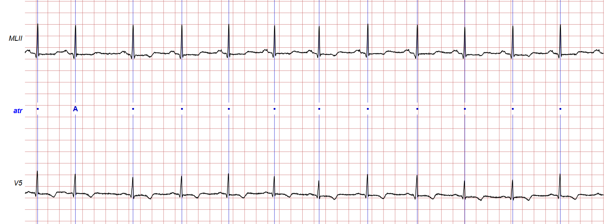
Comparitive Analysis of result of CORDIC-ECG-Processor and Pantopkins Algorithm
<p align="center">
  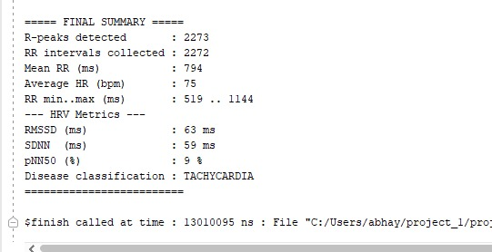
  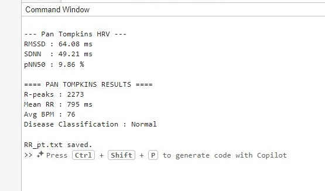
</p>

| Parameter | Pan-Tompkins | CORDIC |
|-----------|--------------|--------|
| R-peaks   | 2273         | 2273   |
| Avg BPM   | 76           | 75     |
| Mean RR   | 795 ms       | 794 ms |
| RMSSD     | 64.08 ms     | 63.00 ms |
| SDNN      | 49.21 ms     | 59.00 ms |
| pNN50     | 9.86%        | 9.00%  ||

> Both methods produce nearly identical results, with minor variation in SDNN, likely due to differences in RR interval detection.

<h3>Signalset 200</h3>
Visual Representation of the Signal
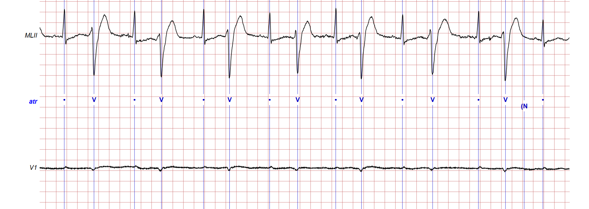
Comparitive Analysis of result of CORDIC-ECG-Processor and Pantopkins Algorithm
<p align="center">
  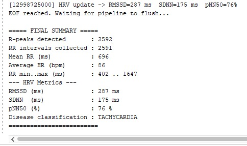
  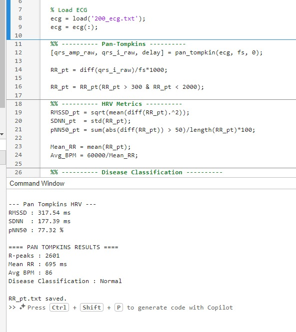
</p>

| Parameter | Pan-Tompkins | CORDIC (FPGA) |
|-----------|--------------|---------------|
| R-peaks   | 2601         | 2592          |
| Avg BPM   | 86           | 86            |
| Mean RR   | 695 ms       | 696 ms        |
| RMSSD     | 317.54 ms    | 287 ms        |
| SDNN      | 177.39 ms    | 175 ms        |
| pNN50     | 77.32%       | 76%           |

> Both methods show very close heart rate values, while slight variations in HRV metrics (RMSSD, SDNN, pNN50) are observed due to differences in R-peak detection and computation approach.

<h3>Signalset 105</h3>
Visual Representation of the Signal
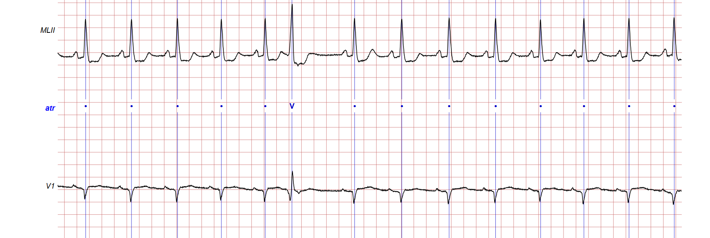
Comparitive Analysis of result of CORDIC-ECG-Processor and Pantopkins Algorithm
<p align="center">
  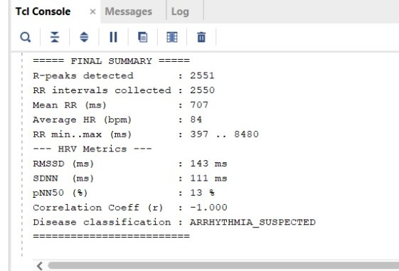
  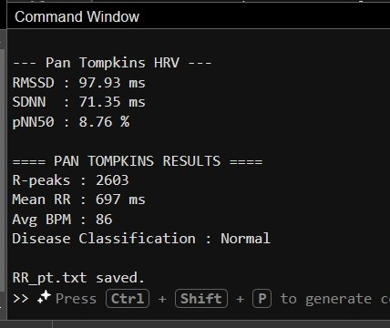
</p>

| Parameter | Pan-Tompkins | CORDIC (FPGA) |
|-----------|--------------|---------------|
| R-peaks   | 2603         | 2551          |
| Avg BPM   | 86           | 84            |
| Mean RR   | 697 ms       | 707 ms        |
| RMSSD     | 97.93 ms     | 143 ms        |
| SDNN      | 71.35 ms     | 111 ms        |
| pNN50     | 8.76%        | 13%           |

> Heart rate parameters match well, but HRV metrics vary due to sensitivity to R-peak timing differences.
<h3>Signalset 115</h3>
Visual Representation of the Signal
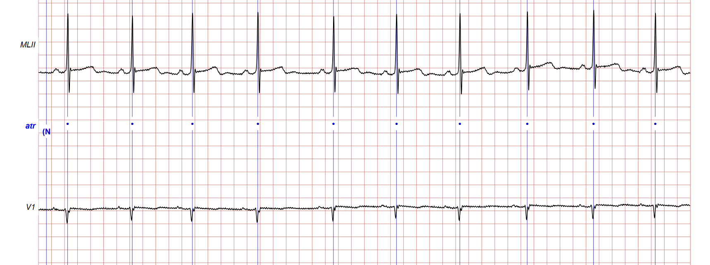
Comparitive Analysis of result of CORDIC-ECG-Processor and Pantopkins Algorithm
<p align="center">
  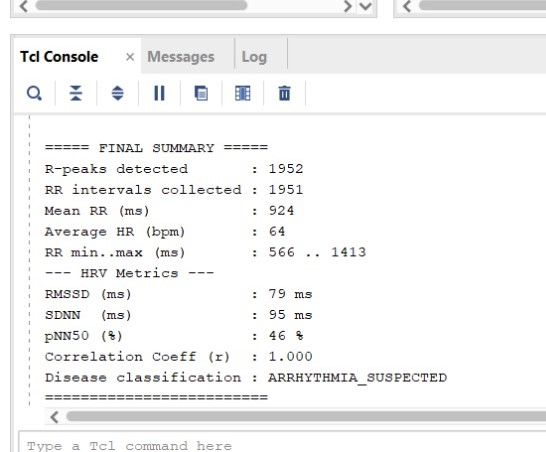
  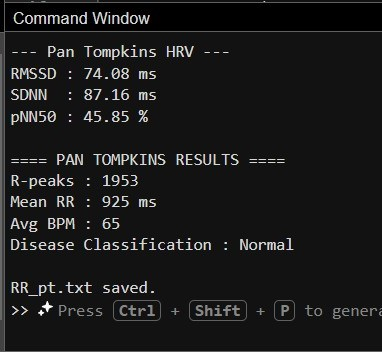
</p>

| Parameter | Pan-Tompkins | CORDIC (FPGA) |
|-----------|--------------|---------------|
| R-peaks   | 3360         | 3277          |
| Avg BPM   | 112          | 109           |
| Mean RR   | 538 ms       | 550 ms        |
| RMSSD     | 77.93 ms     | 135 ms        |
| SDNN      | 53.42 ms     | 111 ms        |
| pNN50     | 14.30%       | 13%           |

> Heart rate parameters match well, but HRV metrics vary due to sensitivity to R-peak timing differences.

<h3>Signalset 215</h3>
Visual Representation of the Signal
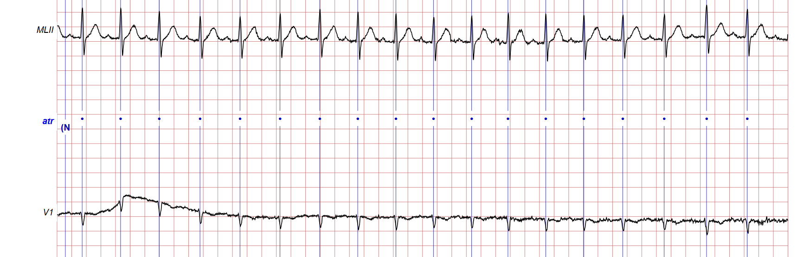
Comparitive Analysis of result of CORDIC-ECG-Processor and Pantopkins Algorithm
<p align="center">
  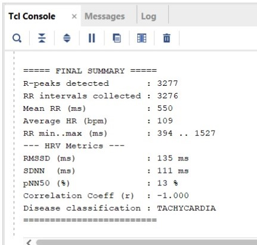
  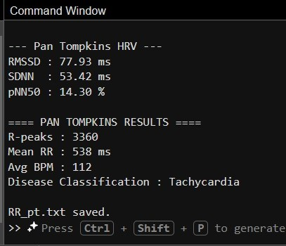
</p>

| Parameter | Pan-Tompkins | CORDIC (FPGA) |
|-----------|--------------|---------------|
| R-peaks   | 1953         | 1952          |
| Avg BPM   | 65           | 64            |
| Mean RR   | 925 ms       | 924 ms        |
| RMSSD     | 74.08 ms     | 79 ms         |
| SDNN      | 87.16 ms     | 95 ms         |
| pNN50     | 45.85%       | 46%           |

> Heart rate parameters match well, but HRV metrics vary due to sensitivity to R-peak timing differences.
---

## Synthesis

### Tool: Cadence Genus

The synthesis of the design was performed using **Cadence Genus**. A TCL script was used to automate the synthesis flow, which was executed using the following command:

```bash
genus -f run.tcl
```

### TCL Script
A **TCL (Tool Command Language) script** is used in Cadence Genus to automate the synthesis process. Instead of manually entering commands, the entire design flow is defined in a script file (`run.tcl`), ensuring consistency, repeatability, and efficiency.

The TCL script typically includes the following steps:

- Reading the RTL design files (Verilog/VHDL)  
- Specifying the target technology library  
- Defining design constraints (timing, clock, input/output delays)  
- Running synthesis and optimization  
- Generating the gate-level netlist  
- Producing reports such as area, power, and timing

```tcl
#============================================================
# Cadence Genus TCL for QRS CORDIC Detector
#============================================================

# Read RTL
read_hdl /home/vlsi24/Abhay/qrs_cordic_detector.v

# Read standard cell library
read_libs /home/install/FOUNDRY/digital/90nm/dig/lib/slow.lib

# Elaborate top module
elaborate qrs_cordic_detector

# Read constraints
read_sdc /home/vlsi24/Abhay/qrs_cordic_detector.sdc

# Synthesis flow
syn_generic
syn_map
syn_opt

# Optional GUI
# gui_show
# gui_hide

# Design checks
check_design
check_timing_intent

# Reports
report_qor > qrs_qor.rep
report_timing > qrs_timing.rep
report_power > qrs_power.rep
report_area > qrs_area.rep

# Write synthesized netlist
write_hdl > qrs_cordic_detector_synth.v

# Write final SDC
write_sdc > qrs_cordic_detector_genus.sdc
```


### Key SDC Constraints

```tcl
create_clock -name clk -period 10.0 -waveform {0 5} [get_ports clk]

set_input_delay  1.0 -clock clk [remove_from_collection [all_inputs] [get_ports clk]]
set_output_delay 1.0 -clock clk [all_outputs]

set_clock_uncertainty 0.2 [get_clocks clk]
set_clock_transition 0.1 [get_clocks clk]

set_load 0.05 [all_outputs]
set_driving_cell -lib_cell BUF_X1 [remove_from_collection [all_inputs] [get_ports clk]]
```

### Synthesis Results

| Metric | Value |
|--------|-------|
| Total cell area | 589729.551 |
| Combinational Instance Count | 112273  |
| Sequential Instance Count | 1140 |
| Power | 5.16800e-02 |

### RTL view


---

## Placement

### Invoking Cadence Innovus
Type innovus to invoke Cadence Innovus
```bash
innovus
```
### Setting up MMMC file

Prior to initiating placement, the MMMC (Multi-Mode Multi-Corner) environment was configured to define the timing corners and constraints required for sign-off accurate analysis.
The following collateral was provided as part of the MMMC setup:
LEF Files — Technology and cell-level abstract views defining routing layers, design rules, and cell geometries
Liberty Files (.lib) — Timing, power, and functional characterization libraries for the target process corner
Capacitance Table (CapTable) Files — Interconnect parasitics data used for accurate RC extraction at the specified process corner

### Scan Configuration Script

```tcl
set_dft_signal -view existing_dft -type ScanClock  -port clk -timing {45 55}
set_dft_signal -view spec         -type Reset       -port reset_n -active_state 0
set_dft_signal -view spec         -type ScanEnable  -port scan_en -active_state 1
set_dft_signal -view spec         -type ScanDataIn  -port scan_in
set_dft_signal -view spec         -type ScanDataOut -port scan_out

set_scan_configuration -chain_count 1
create_test_protocol
dft_drc
preview_dft
insert_dft

write_scan_def -output dft/def/ecg_top_scan.def
write_verilog  dft/netlists/ecg_top_scan.v
```

### DFT Results

| Metric | Value |
|--------|-------|
| Scan flip-flops | [fill] |
| Scan chains | 1 |
| Scan coverage | [fill] % |
| DFT DRC violations | 0 (target) |

---

## Static Timing Analysis (STA)

### Tool: Synopsys PrimeTime

```bash
cd sta/
pt_shell -f scripts/primetime_sta.tcl | tee logs/sta.log
```

| Check | Corner | WNS | TNS | Status |
|-------|--------|-----|-----|--------|
| Setup | WCS (Slow) | [fill] ns | [fill] ns | [PASS/FAIL] |
| Hold | BCF (Fast) | [fill] ns | [fill] ns | [PASS/FAIL] |

---

## Formal Verification

### Tool: Synopsys Formality

```bash
cd formal/
fm_shell -f scripts/formality.tcl | tee logs/formality.log
```

| Check | Result |
|-------|--------|
| RTL vs Post-synthesis netlist | [EQUIVALENT] |
| Post-synthesis vs Post-DFT netlist | [EQUIVALENT] |

---

## Physical Design (PnR)

### Tool: Cadence Innovus

```bash
cd pnr/
innovus -batch -src scripts/innovus_pnr.tcl | tee logs/innovus.log
```

Flow steps: Floorplanning → Power Planning → Placement → CTS → Post-CTS Optimization → Routing → Post-Route ECO → Filler/Decap Insertion.

### PnR Results

| Metric | Value |
|--------|-------|
| Die area | [fill] µm² |
| Core utilization | [fill] % |
| Clock skew | [fill] ps |
| Routing DRC violations | 0 (target) |

---

## Sign-off and GDS Generation

```bash
cd signoff/
calibre -drc -hier scripts/calibre_drc.tcl    # Physical DRC
calibre -lvs -hier scripts/calibre_lvs.tcl    # Layout vs Schematic
calibre -xrc       scripts/calibre_rcx.tcl    # RC Parasitic Extraction
```

### Sign-off Checklist

- [ ] DRC clean — 0 violations
- [ ] LVS clean — netlist matches layout
- [ ] Post-layout STA with extracted parasitics — timing closure confirmed
- [ ] IR drop analysis — passed
- [ ] GDS-II exported: `signoff/gds/ecg_top_final.gds`

---

## Tool Flow Summary

```
ECG RTL (Verilog / SystemVerilog)
         │
         ▼
Functional Simulation ─────────── (VCS / Xcelium / ModelSim)
         │
         ▼
Logic Synthesis ────────────────── (Synopsys Design Compiler)
         │
         ▼
DFT Scan Insertion ─────────────── (Synopsys DFT Compiler)
         │
         ▼
Formal Equivalence Check ──────── (Synopsys Formality)
         │
         ▼
Pre-Layout STA ─────────────────── (Synopsys PrimeTime)
         │
         ▼
Place and Route ────────────────── (Cadence Innovus)
         │
         ▼
Post-Route STA + Sign-off ──────── (PrimeTime + Calibre)
         │
         ▼
GDS-II Output ✓
```

---

## Results and Reports

### Area Breakdown (Post-PnR)

| Module | Area (µm²) |
|--------|------------|
| cordic_mag_pipelined | [fill] |
| bandpass_filter_5_15 | [fill] |
| qrs_peak_detect | [fill] |
| rr_bpm_calc | [fill] |
| hrv_metrics (incl. 3x isqrt32) | [fill] |
| **Total** | [fill] |

### Power and Coverage

| Metric | Value |
|--------|-------|
| Dynamic power | [fill] mW |
| Leakage power | [fill] mW |
| Scan coverage | [fill] % |

---

## How to Run

```bash
git clone https://github.com/<your-username>/ECG-Signal-Processor-using-CORDIC-Algorithm-RTL-to-GDS-flow.git
cd ECG-Signal-Processor-using-CORDIC-Algorithm-RTL-to-GDS-flow

make sim       # RTL simulation only
make synth     # Logic synthesis
make dft       # DFT scan insertion
make sta       # Static timing analysis
make pnr       # Place and route
make signoff   # DRC / LVS / GDS export
make all       # Full flow end to end
make clean     # Remove all generated outputs
```

---

## Dependencies and Setup

| Tool / Package | Purpose |
|----------------|---------|
| Synopsys VCS or Cadence Xcelium | RTL simulation |
| Synopsys Design Compiler | Logic synthesis |
| Synopsys DFT Compiler | Scan insertion |
| Synopsys PrimeTime | STA |
| Synopsys Formality | Formal verification |
| Cadence Innovus | Place and Route |
| Mentor Calibre | DRC / LVS |
| Python 3 + wfdb + numpy | ECG data preparation |

```bash
# Install Python dependencies
pip install wfdb numpy

# Set PDK environment variable
export PDK_ROOT=/path/to/your/pdk
```

---

## Future Work

- [ ] Add CORDIC gain compensation (fixed-point: multiply by 39243, right-shift by 16)
- [ ] Extend to full Pan-Tompkins algorithm (squaring + moving-window integration stages)
- [ ] Implement adaptive thresholding for THRESHOLD_HIGH / THRESHOLD_LOW
- [ ] Add AXI4-Lite slave interface for SoC integration
- [ ] Develop UVM testbench with functional coverage and constrained-random stimulus
- [ ] Extend DFT to include MBIST for any embedded SRAM
- [ ] Tape-out using Sky130 open-source PDK via OpenLane

---

## References

1. J. Volder, "The CORDIC Trigonometric Computing Technique," *IRE Transactions on Electronic Computers*, 1959.
2. J. Pan and W. J. Tompkins, "A Real-Time QRS Detection Algorithm," *IEEE Transactions on Biomedical Engineering*, vol. 32, no. 3, 1985.
3. Task Force of ESC and NASPE, "Heart Rate Variability: Standards of Measurement, Physiological Interpretation, and Clinical Use," *Circulation*, 1996.
4. MIT-BIH Arrhythmia Database — [PhysioNet](https://physionet.org/content/mitdb/1.0.0/)
5. Synopsys DFT Compiler User Guide.
6. Cadence Innovus Implementation System User Guide.

---

## License

This project is licensed under the [MIT License](LICENSE).

---

